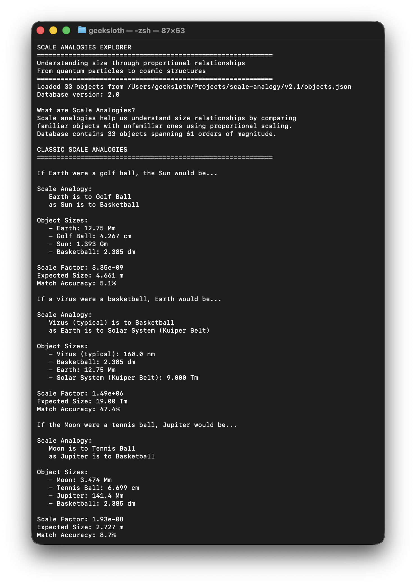

# Scale Analogies Explorer - Mathematical Framework

A mathematical tool for comparing object sizes across 61 orders of magnitude using proportional scaling relationships.

## Mathematical Foundations

### Core Scale Analogy Formula

For scale analogies "if A is to B, then C is to D":

$$\frac{D}{C} = \frac{B}{A} \quad \Rightarrow \quad D = C \cdot \frac{B}{A}$$

**Example:** If hydrogen atom ($1.06 \times 10^{-10}$ m) → golf ball ($4.267 \times 10^{-2}$ m), then Earth ($1.2749 \times 10^7$ m) → ?

$$k = \frac{4.267 \times 10^{-2}}{1.06 \times 10^{-10}} = 4.025 \times 10^{11}$$

$$D = 1.2749 \times 10^7 \times 4.025 \times 10^{11} = 5.133 \times 10^{18} \text{ m}$$

### Database Coverage

**Scale Range:** $10^{-35}$ to $10^{26}$ meters (61 orders of magnitude)
**Object Count:** 33 objects across 9 scale domains

$$\text{Total Range} = \log_{10}(10^{26}) - \log_{10}(10^{-35}) = 61$$

### Scale Domain Classification

$$\begin{align}
\text{Quantum:} \quad &d < 10^{-15} \text{ m} \\
\text{Atomic:} \quad &10^{-15} \leq d < 10^{-9} \text{ m} \\
\text{Molecular:} \quad &10^{-9} \leq d < 10^{-6} \text{ m} \\
\text{Cellular:} \quad &10^{-6} \leq d < 10^{-3} \text{ m} \\
\text{Everyday:} \quad &10^{-3} \leq d < 10^{3} \text{ m} \\
\text{Geographic:} \quad &10^{3} \leq d < 10^{7} \text{ m} \\
\text{Planetary:} \quad &10^{7} \leq d < 10^{9} \text{ m} \\
\text{Stellar:} \quad &10^{9} \leq d < 10^{12} \text{ m} \\
\text{Galactic:} \quad &d \geq 10^{12} \text{ m}
\end{align}$$

### Metric Prefix Conversion

$$d_{\text{meters}} = d_{\text{input}} \times 10^n$$

| Prefix | Symbol | Power $n$ | Example |
|--------|---------|-----------|---------|
| yocto  | ym      | -24      | $10^{-24}$ m |
| zepto  | zm      | -21      | $10^{-21}$ m |
| atto   | am      | -18      | $10^{-18}$ m |
| femto  | fm      | -15      | $10^{-15}$ m |
| pico   | pm      | -12      | $10^{-12}$ m |
| nano   | nm      | -9       | $10^{-9}$ m |
| micro  | μm      | -6       | $10^{-6}$ m |
| milli  | mm      | -3       | $10^{-3}$ m |
| ⋮      | ⋮       | ⋮        | ⋮ |
| kilo   | km      | 3        | $10^{3}$ m |
| mega   | Mm      | 6        | $10^{6}$ m |
| giga   | Gm      | 9        | $10^{9}$ m |
| tera   | Tm      | 12       | $10^{12}$ m |
| yotta  | Ym      | 24       | $10^{24}$ m |

### Optimal Unit Selection Algorithm

$$\text{unit}_{\text{optimal}} = \max \{ u \mid \frac{d_{\text{meters}}}{10^{n_u}} \geq 1 \}$$

### Range Handling Mathematics

For objects with size ranges $[d_{\min}, d_{\max}]$:

**Arithmetic Mean (Current Implementation):**

$$d_{\text{effective}} = \frac{d_{\min} + d_{\max}}{2}$$

**Geometric Mean (Alternative):**

$$d_{\text{effective}} = \sqrt{d_{\min} \times d_{\max}}$$

### Computational Complexity

| Operation | Complexity | Formula |
|-----------|------------|---------|
| Size Comparison | $O(1)$ | $R = \frac{d_1}{d_2}$ |
| Best Match Finding | $O(n)$ | $\arg\min_i \|d_i - d_{\text{target}}\|$ |
| Range Queries | $O(n)$ | $\{o_i : d_{\min} \leq d_i \leq d_{\max}\}$ |
| Analogy Generation | $O(n)$ | Scale all objects, find closest |

### Error Analysis

**Accuracy Measurement:**

$$\text{Accuracy} = \left(1 - \frac{|d_{\text{actual}} - d_{\text{expected}}|}{d_{\text{expected}}}\right) \times 100\%$$

**Error Propagation for Ranges:**

$$\sigma_{\text{ratio}} = \sqrt{\left(\frac{\partial R}{\partial d_1}\sigma_{d_1}\right)^2 + \left(\frac{\partial R}{\partial d_2}\sigma_{d_2}\right)^2}$$

## Implementation (v2.1)

### Database Structure
```json
{
  "_metadata": {
    "total_objects": 33,
    "scale_range": "10^-35 to 10^26 meters"
  },
  "objects": {
    "object_key": {
      "n": "Name", "d": 1.23e-10, "r": [1.0e-10, 1.5e-10]
    }
  }
}
```

### Core Algorithm
```python
def create_scale_analogy(self, obj1, obj2, obj3):
    size1, size2, size3 = [self.get_diameter_in_meters(obj) for obj in [obj1, obj2, obj3]]
    scale_factor = size2 / size1
    expected_size = size3 * scale_factor
    return self.find_closest_object(expected_size)
```

## Example Output



**Mathematical Result:**
```
Scale Analogy: Hydrogen Atom → Golf Ball :: Earth → Solar System
Scale Factor: k = 4.03×10¹¹
Expected Size: 5.14 Tm
Closest Match: Solar System (9.00 Tm, 42.9% accuracy)
```

## Usage

```python
from main import ObjectSizeComparator
comparator = ObjectSizeComparator()

# Scale analogy calculation
analogy = comparator.create_scale_analogy('hydrogen_atom', 'golf_ball', 'earth')
# Returns: scale_factor=4.025e11, expected_size=5.133e18m

# Direct comparison
ratio = comparator.compare_objects('earth', 'golf_ball')
# Returns: ratio=2.99e8
```

## Quick Start

```bash
cd v2.1/
python main.py
```

**Files:** `main.py` (core math), `objects.json` (database), `test_v2.py` (validation)
